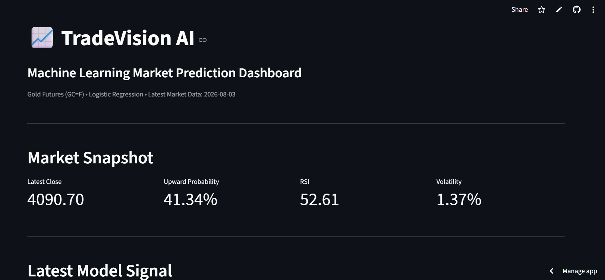
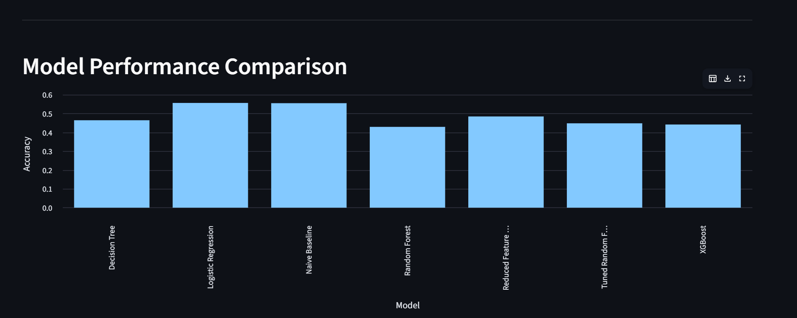
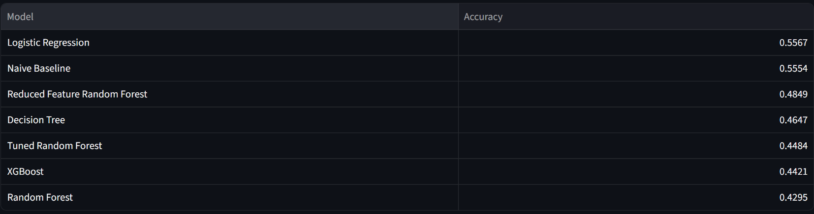
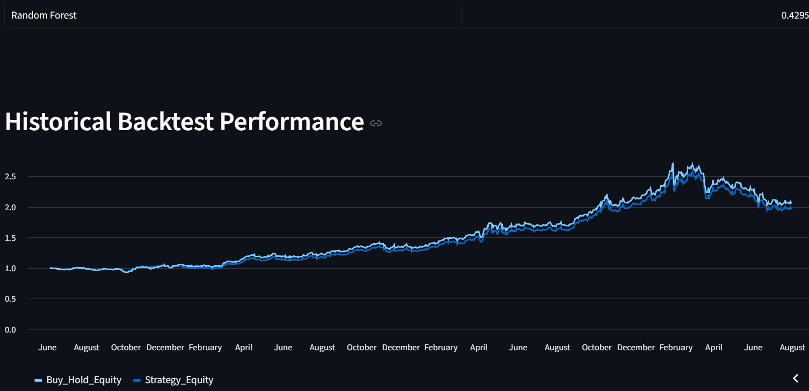

# TradeVision AI

## Machine Learning Market Prediction Dashboard

TradeVision AI is a machine learning project that analyzes historical gold futures data (`GC=F`) and predicts the probability of upward price movement.

The project includes data collection, data validation, feature engineering, technical indicators, machine learning models, model evaluation, backtesting, and an interactive Streamlit dashboard.

> **Note:** This project is for educational and research purposes only and is not financial advice.


## Dashboard Preview



### Model Performance





### Backtesting Performance



[View the Live Dashboard](https://tradevision-ai-im5qbqcqullsxmfuar3wrr.streamlit.app/)

## Project Overview

The project follows an end-to-end machine learning workflow:

1. Collect historical gold futures data
2. Validate and profile the dataset
3. Build technical features
4. Prepare training and testing data
5. Train multiple machine learning models
6. Tune selected models
7. Compare model performance
8. Analyze prediction probabilities
9. Perform statistical testing
10. Backtest the trading strategy
11. Analyze strategy performance and risk
12. Deploy the results through a Streamlit dashboard


## Technical Indicators

The model uses:

- Simple Moving Average (SMA 20)
- Simple Moving Average (SMA 50)
- Simple Moving Average (SMA 200)
- Exponential Moving Average (EMA 20)
- Relative Strength Index (RSI)
- Moving Average Convergence Divergence (MACD)
- MACD Signal
- Bollinger Bands
- Average True Range (ATR)
- Daily Return
- Log Return
- Volatility
- Trading Volume
- Day of Week
- Month
- Quarter


## Machine Learning Models

The project evaluates:

- Logistic Regression
- Decision Tree
- Random Forest
- Tuned Random Forest
- XGBoost
- Reduced Feature Random Forest
- Naive Baseline


## Model Performance

| Model | Accuracy |
|---|---:|
| Logistic Regression | 55.67% |
| Naive Baseline | 55.54% |
| Reduced Feature Random Forest | 48.49% |
| Decision Tree | 46.47% |
| Tuned Random Forest | 44.84% |
| XGBoost | 44.21% |
| Random Forest | 42.95% |

**Best-performing model:** Logistic Regression

**Accuracy:** 55.67%

The results demonstrate that a simpler model can outperform more complex models on this particular dataset.


## Backtesting

The trading strategy was evaluated from:

**2023-06-06 to 2026-07-31**

| Metric | TradeVision AI | Buy & Hold |
|---|---:|---:|
| Total Return | 98.85% | 108.13% |
| Annualized Return | 25.69% | 26.23% |
| Maximum Drawdown | -25.06% | -25.06% |

Additional strategy metrics:

- Sharpe Ratio: **1.2237**
- Signal Win Rate: **55.79%**
- Position Change Rate: **4.04%**
- Average Days Between Position Changes: **24.78**

The backtest produced a strong historical return, but the strategy did not outperform the Buy & Hold benchmark over the tested period.


## Statistical Analysis

The project also tests whether bullish signals were associated with meaningfully different subsequent returns.

- Bullish signal mean return: **0.1022%**
- No-signal mean return: **0.0590%**
- Difference: **0.0432%**
- T-statistic: **0.2774**
- P-value: **0.7836**

**Result:** Not statistically significant at the 5% level.

This indicates that the observed difference in returns should not be interpreted as strong statistical evidence of predictive power.


## Dashboard

TradeVision AI includes an interactive Streamlit dashboard displaying:

- Latest model prediction
- Upward-movement probability
- Technical indicators
- Historical gold price data
- Model performance comparison
- Historical backtest performance
- Backtest results
- Strategy risk metrics
- Prediction confidence


### Run the Dashboard

streamlit run dashboard/app.py

Project Structure
```text
TradeVision-AI/
├── dashboard/
│   └── app.py
├── data/
│   ├── raw/
│   └── processed/
├── reports/
│   └── permutation_importance.csv
├── saved_models/
│   ├── decision_tree.pkl
│   ├── logistic_regression.pkl
│   ├── random_forest.pkl
│   ├── tradevision_final.pkl
│   └── xgboost.pkl
├── src/
│   ├── config/
│   ├── data/
│   ├── features/
│   ├── models/
│   └── visualization/
├── .gitignore
├── PROJECT_PROGRESS.md
├── README.md
└── requirements.txt
```


## Technologies
- Python
- Pandas
- NumPy
- Scikit-learn
- XGBoost
- yfinance
- TA
- Matplotlib
- Streamlit
- Git
- GitHub


## Installation

Clone the repository:

```git clone https://github.com/phenyosepato/TradeVision-AI.git ```

Navigate into the project:

```cd TradeVision-AI ```

Create a virtual environment:

```python -m venv .venv ```

Install dependencies:

```pip install -r requirements.txt ```

Run the dashboard:

```streamlit run dashboard/app.py```


## Limitations

TradeVision AI is an experimental machine learning project.

The model's predictive accuracy is only modestly above the naive baseline, and statistical testing did not identify a statistically significant difference between bullish and non-bullish signal returns.

Historical backtesting does not guarantee future performance.

The project is intended to demonstrate practical skills in:

- Machine learning
- Data analysis
- Feature engineering
- Model evaluation
- Financial data analysis
- Backtesting
- Risk analysis
- Python development
- Dashboard development


## Author

Phenyo Sepato

GitHub: phenyosepato
